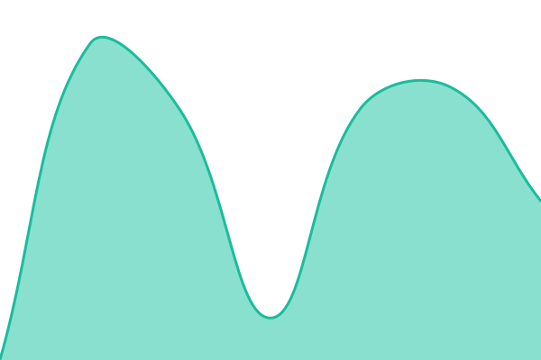

# [📈 Live Status](https://status.collabops.ai): <!--live status--> **🟩 All systems operational**

This repository contains the open-source uptime monitor and status page for [CollabOps.AI](https://status.collabops.ai), powered by [Upptime](https://github.com/upptime/upptime).

With [Upptime](https://upptime.js.org), you can get your own unlimited and free uptime monitor and status page, powered entirely by a GitHub repository. We use [Issues](https://github.com/CollabOps/status/issues) as incident reports, [Actions](https://github.com/CollabOps/status/actions) as uptime monitors, and [Pages](https://status.collabops.ai) for the status page.

<!--start: status pages-->
<!-- This summary is generated by Upptime (https://github.com/upptime/upptime) -->
<!-- Do not edit this manually, your changes will be overwritten -->
<!-- prettier-ignore -->
| URL | Status | History | Response Time | Uptime |
| --- | ------ | ------- | ------------- | ------ |
|  [CollabOps Cloud](https://collabops.ai) | 🟩 Up | [collab-ops-cloud.yml](https://github.com/CollabOps/status/commits/HEAD/history/collab-ops-cloud.yml) | 

 1951ms
     
 | 

<a href="https://status.collabops.ai/history/collab-ops-cloud">100.00%</a>
    

|  [Web App](https://app.collabops.ai) | 🟩 Up | [web-app.yml](https://github.com/CollabOps/status/commits/HEAD/history/web-app.yml) | 

 585ms
     
 | 

<a href="https://status.collabops.ai/history/web-app">100.00%</a>
    

|  [API](https://collabops.ai/api/v2/health) | 🟩 Up | [api.yml](https://github.com/CollabOps/status/commits/HEAD/history/api.yml) | 

 580ms
     
 | 

<a href="https://status.collabops.ai/history/api">100.00%</a>
    

|  [Git / Repository](https://collabops.ai/collabops-one/probe.git/info/refs?service=git-upload-pack) | 🟩 Up | [git-repository.yml](https://github.com/CollabOps/status/commits/HEAD/history/git-repository.yml) | 

 1552ms
     
 | 

<a href="https://status.collabops.ai/history/git-repository">100.00%</a>
    

|  [CI/CD](https://tekton.collabops.ai) | 🟩 Up | [ci-cd.yml](https://github.com/CollabOps/status/commits/HEAD/history/ci-cd.yml) | 

 575ms
     
 | 

<a href="https://status.collabops.ai/history/ci-cd">100.00%</a>
    

|  [Docs](https://docs.collabops.ai) | 🟩 Up | [docs.yml](https://github.com/CollabOps/status/commits/HEAD/history/docs.yml) | 

 960ms
     
 | 

<a href="https://status.collabops.ai/history/docs">100.00%</a>
    

|  [Notifications](https://ws.collabops.ai) | 🟩 Up | [notifications.yml](https://github.com/CollabOps/status/commits/HEAD/history/notifications.yml) | 

 610ms
     
 | 

<a href="https://status.collabops.ai/history/notifications">100.00%</a>
    

<!--end: status pages-->

[**Visit our status website →**](https://status.collabops.ai)

## 📄 License

- Powered by: [Upptime](https://github.com/upptime/upptime)
- Code: [MIT](./LICENSE) © [Anand Chowdhary](https://anandchowdhary.com)
- Data in the `./history` directory: [Open Database License](https://opendatacommons.org/licenses/odbl/1-0/)
